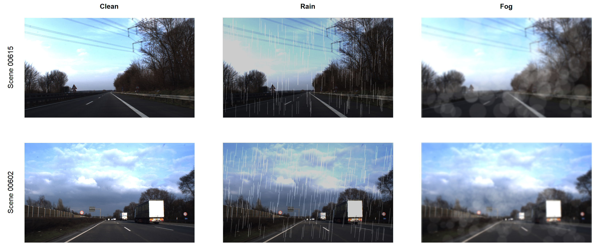

# Weather Stratified Tail Latency Profiling of Quantized TSR

Real-time traffic-sign recognition (TSR) for advanced driverassistance systems (ADAS) had become accurate and fast on clear-weather
benchmarks. The accuracy lost under specific weather, and the latency
that this robustness had cost once a model was quantized for the edge,
had seldom been measured together; an average frame rate had been reported in place of the latency tail that a vehicle must clear. A weatherstratified and latency-aware evaluation of a compact detector was therefore carried out. A YOLOv8n model had been trained on the German Traffic Sign Detection Benchmark (GTSDB), and matched clean,
rain, and fog evaluation sets had been rendered from the same held-out
frames. The model had been compressed to 8-bit integers (INT8) by calibrated post-training quantization (PTQ), and five central- and graphicsprocessing-unit backends had been profiled. For each condition, the mean
average precision (mAP) had been recorded next to the median and the
95th-percentile latency. Rain and fog had lowered mAP@50 by 26.7% and
34.7% relative to clean weather, whereas quantization had cost at most
4.6% mAP and had shrunk the model from 11.73 to 3.45 megabytes. Latency had stayed condition-invariant, because weather changes pixels and
not computation. The INT8 backend had reached 2.39 times the baseline
throughput, and a half-precision graphics engine had reached 8.95 times,
each with a narrow tail. The protocol makes the robustness-latency tradeoff explicit and reproducible, and it indicates where mitigation effort is
best spent for embedded TSR

---

## Table of contents

- [Overview](#overview)
- [Dataset](#dataset)
- [RoBERTa](#roberta)
- [Independet Q-learning](#independet-q-learning)
- [GraphSAGE](#graphsage)

## Overview

1. The Model: Yolov8n

2. Weather-Stratified Dataset

3. INT8 Post-Training Quantization

## Architecture and Methodology

